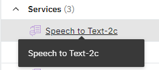

# watson-stt
A command line interface for IBM Watson's [speech to text service](https://cloud.ibm.com/catalog/services/speech-to-text).

## Installation
```
$ git clone https://github.com/unccard/watson-stt-cli
$ cd watson-stt-cli
$ pip install .
```

## Obtaining your IBM Cloud credentials
**In addition** you will need to download your IBM Cloud credentials for your speech to text instance.
1. Navigate to the [IBM Cloud Resources list](https://cloud.ibm.com/resources), logging in if you aren't already logged in.
2. Select your Speech to Text service instance:<br>
   
3. In the "Credentials" pane, select "Download."<br>
   
4. Save the `ibm-credentials.env` file and note the directory you saved it in.

## Usage
Navigate to where you saved your IBM Cloud credentials, then run
```
$ watson-stt [audiofile]
```
For full usage info, use `watson-stt --help`.
## License
MIT
